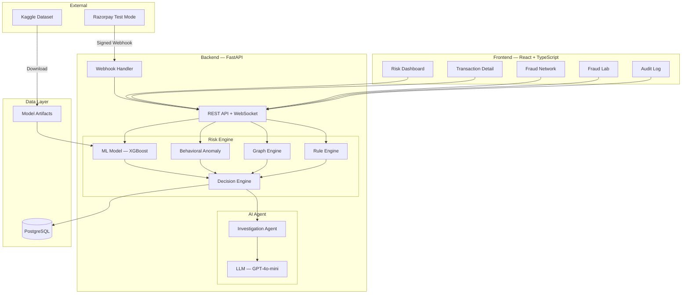

# 🛡️ Sentinel — AI-Powered Payment Risk Control Tower

> **Sentinel** is a production-quality payment risk intelligence platform that combines real-time risk scoring, behavioral anomaly detection, fraud-network graph analysis, explainable AI investigations, and payment event intelligence — all in one unified system.

[](https://github.com/PRANAYRAJU07/sentinel-payment-risk/actions/workflows/backend.yml)
[](https://github.com/PRANAYRAJU07/sentinel-payment-risk/actions/workflows/frontend.yml)
[](https://opensource.org/licenses/MIT)

---

## 🚨 The Problem

Payment fraud costs businesses billions of dollars annually. Traditional rule-based fraud detection:
- Generates too many false positives (blocking legitimate customers)
- Misses novel attack patterns (new fraud vectors bypass static rules)
- Provides no explanation (analysts can't understand why a transaction was blocked)
- Lacks graph-level intelligence (misses coordinated fraud rings)
- Has no feedback loop (human decisions don't improve the system)

**Most fraud detection projects answer one question:** *"Is this transaction fraudulent?"*

---

## 💡 The Solution — What Sentinel Asks Instead

Sentinel goes beyond binary classification by asking:

- **Is this transaction unusual?** (ML risk scoring)
- **Is this customer behaving unusually?** (Behavioral anomaly detection)
- **Is this merchant experiencing unusual activity?** (Merchant velocity analysis)
- **Is this transaction connected to other suspicious entities?** (Fraud graph engine)
- **What evidence supports the decision?** (Explainable AI with SHAP)
- **What should the analyst do next?** (AI Investigation Agent)

This distinction is fundamental to Sentinel's architecture.

---

## 🏗️ Architecture



---

## ✨ Features

| Feature | Status |
|---------|--------|
| Real-time payment event ingestion | ✅ |
| Razorpay Test Mode webhook integration | ✅ |
| HMAC-SHA256 webhook signature verification | ✅ |
| ML-based transaction risk scoring (XGBoost) | ✅ |
| Behavioral anomaly detection (Isolation Forest) | ✅ |
| Fraud network / graph analysis (NetworkX) | ✅ |
| Explainable risk decisions (SHAP) | ✅ |
| AI-powered investigation reports (LLM) | ✅ |
| Fraud attack simulation | ✅ |
| Analyst review and override workflow | ✅ |
| Full audit logging | ✅ |
| Model evaluation and drift monitoring | ✅ |
| Interactive risk dashboard | ✅ |
| Kaggle dataset ingestion pipeline | ✅ |
| Reproducible ML training pipeline | ✅ |
| Dockerized development environment | ✅ |
| Automated CI/CD tests | ✅ |
| Demo mode (no external APIs needed) | ✅ |

---

## 🛠️ Tech Stack

### Backend
- **Python 3.11** + **FastAPI** + **Pydantic v2**
- **SQLAlchemy** (async) + **Alembic** (migrations)
- **PostgreSQL 16**

### ML Pipeline
- **Pandas** + **NumPy** + **Scikit-learn**
- **XGBoost** (supervised classification)
- **Isolation Forest** (behavioral anomaly detection)
- **SHAP** (explainability)
- **NetworkX** (fraud graph)

### Frontend
- **React 18** + **TypeScript** + **Vite**
- **Tailwind CSS** (styling)
- **Recharts** (charts)
- **React Flow** (fraud network visualization)

### Infrastructure
- **Docker** + **Docker Compose**
- **GitHub Actions** (CI/CD)

---

## 🤖 ML Pipeline

```
Kaggle Dataset
     ↓
Data Profiling (ydata-profiling)
     ↓
Preprocessing Pipeline (scaling, encoding, imputation)
     ↓
Feature Engineering (velocity, behavioral, temporal features)
     ↓
Model Training (Logistic Regression → Random Forest → XGBoost)
     ↓
Evaluation (PR-AUC, ROC-AUC, F1, FPR, FNR)
     ↓
Risk Score (0–100) + Decision (APPROVE / REVIEW / HOLD)
     ↓
Model Artifact + Metadata → Version Registry
```

---

## 🕸️ Fraud Graph Engine

Sentinel builds a relationship graph of payment entities:

- **Nodes**: Customer, Device, IP Address, Merchant, Transaction
- **Edges**: USED_DEVICE, USED_IP, MADE_TRANSACTION, AT_MERCHANT

Graph-derived signals:
- How many accounts share the same device?
- How many accounts cluster on the same IP?
- Is this customer connected to known fraudulent nodes?
- What is the transaction cluster density?

---

## 🔬 AI Investigator

The AI Investigation Agent does **NOT** make fraud decisions. The ML engine does.

Instead, the agent receives structured, verified evidence and produces:
1. Investigation narrative summary
2. Key risk evidence
3. Suspicious entity relationships
4. Recommended analyst action
5. Questions for human review

**Prompt injection protection**: All transaction data is treated as untrusted. System instructions and user data are strictly separated.

---

## 🎭 Razorpay Integration

Sentinel operates in **TEST MODE ONLY**.

- Webhook endpoint: `POST /api/v1/webhooks/razorpay`
- Signature verification: HMAC-SHA256 with `X-Razorpay-Signature`
- Idempotency via `x-razorpay-event-id`
- Supported events: `payment.authorized`, `payment.captured`, `payment.failed`, `order.paid`

> ⚠️ **DEMO MODE**: All Razorpay features work with synthetic data when `DEMO_MODE=true`.

---

## 🧪 Fraud Lab

Simulate real attack patterns:

| Attack Type | Description |
|-------------|-------------|
| Card Testing | 50+ low-value rapid transactions from one device |
| Account Takeover | Unusual behavior from existing customer |
| Transaction Burst | Sudden spike in high-value transactions |
| Device Sharing | Multiple accounts on same device |
| IP Cluster | Coordinated fraud from IP range |
| Impossible Travel | Location changes faster than possible |
| Coordinated Fraud | Organized ring across multiple accounts |

---

## 🖥️ Screenshots

> _Screenshots will be added after the full UI is implemented_

---

## 🚀 Local Setup

### Prerequisites
- Python >= 3.10
- Node.js >= 20
- Docker + Docker Compose
- Git

### 1. Clone the repository
```bash
git clone https://github.com/PRANAYRAJU07/sentinel-payment-risk.git
cd sentinel-payment-risk
```

### 2. Configure environment variables
```bash
cp .env.example .env
# Edit .env and fill in your credentials
```

### 3. Start PostgreSQL
```bash
docker compose up -d postgres
```

### 4. Set up backend
```bash
cd backend
pip install -r requirements.txt
alembic upgrade head
cd ..
```

### 5. Set up frontend
```bash
cd frontend
npm install
cd ..
```

### 6. Download dataset
```bash
python scripts/download_dataset.py
```

### 7. Train model
```bash
python scripts/train_model.py
```

### 8. Seed demo data
```bash
python scripts/seed_database.py
```

### 9. Start the application
```bash
# Terminal 1: Backend
cd backend && uvicorn app.main:app --reload

# Terminal 2: Frontend
cd frontend && npm run dev
```

### 10. Access
- **Frontend**: http://localhost:5173
- **Backend API**: http://localhost:8000
- **API Docs**: http://localhost:8000/docs

---

## 🔐 Environment Variables

See [.env.example](.env.example) for all required variables.

**NEVER commit `.env` to Git.**

---

## 📊 Dataset

Sentinel uses a public Kaggle fraud dataset (see `ml/src/ingestion/dataset_registry.py`).

Download instructions:
1. Create a Kaggle account at https://kaggle.com
2. Go to Account → Create API Token → download `kaggle.json`
3. Set `KAGGLE_USERNAME` and `KAGGLE_API_TOKEN` in your `.env`
4. Run: `python scripts/download_dataset.py`

**The dataset is NOT committed to Git.**

---

## 🔌 API

See [docs/api.md](docs/api.md) for complete API documentation.

Key endpoints:
```
GET  /api/v1/health
GET  /api/v1/transactions
GET  /api/v1/transactions/{id}
POST /api/v1/risk/score
GET  /api/v1/fraud-clusters
POST /api/v1/simulator/run
POST /api/v1/analyst-review
GET  /api/v1/audit-log
POST /api/v1/webhooks/razorpay
```

---

## 🧪 Testing

```bash
# Backend tests
cd backend && pytest tests/ -v

# Frontend tests
cd frontend && npm run test

# All tests
make test
```

---

## 🎬 5-Minute Demo

1. **0:00** — Open dashboard at http://localhost:5173
2. **0:30** — Show live transaction feed with risk scores
3. **1:00** — Navigate to `/transactions` for full list
4. **1:30** — Go to `/fraud-lab`, select "Card Testing" attack
5. **2:00** — Launch simulation → watch high-risk transactions appear
6. **2:30** — Click a HIGH risk transaction → see risk breakdown
7. **3:00** — Go to `/fraud-network` → see the device cluster highlighted
8. **3:30** — Click "Run AI Investigation" → read the report
9. **4:00** — Click "HOLD" → see analyst review created
10. **4:30** — Go to `/audit-log` → see full action history
11. **4:45** — Go to `/models` → show PR-AUC and model metrics
12. **5:00** — Summarize: Sentinel is a complete risk intelligence system, not just a classifier

---

## ⚠️ Limitations

- This is a **portfolio/prototype project**, not a production payment system
- Razorpay integration uses **TEST MODE** only — no real money
- AI investigator requires an LLM API key (OpenAI by default) — DEMO MODE bypasses this
- Graph engine uses NetworkX (single-node) — a production system would use Neo4j
- Drift monitoring is a prototype — not a production MLOps solution
- Model is trained on a public dataset — not on real payment data

---

## 🔮 Future Work

- Streaming architecture (Apache Kafka / Flink)
- Graph database (Neo4j)
- Online learning / incremental model updates
- Feature store (Feast)
- Model registry (MLflow)
- Advanced drift monitoring
- Multi-tenant support
- Hardware Security Module (HSM) for key management
- RBAC with fine-grained permissions
- PCI-DSS compliance checklist

---

## 📄 License

MIT © 2026 PRANAYRAJU07
